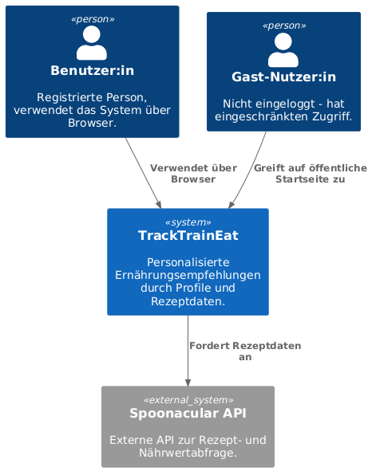
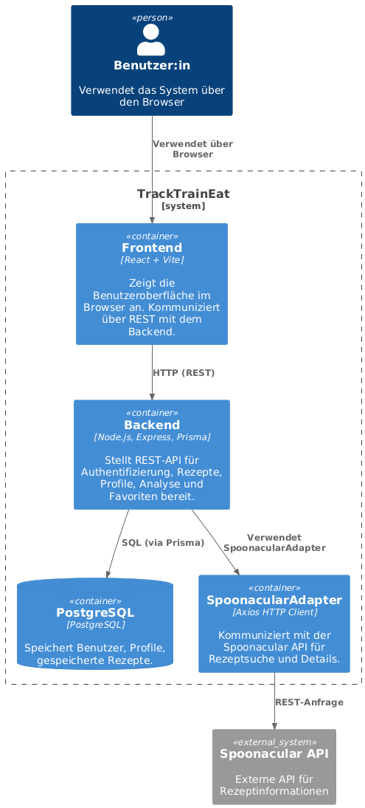
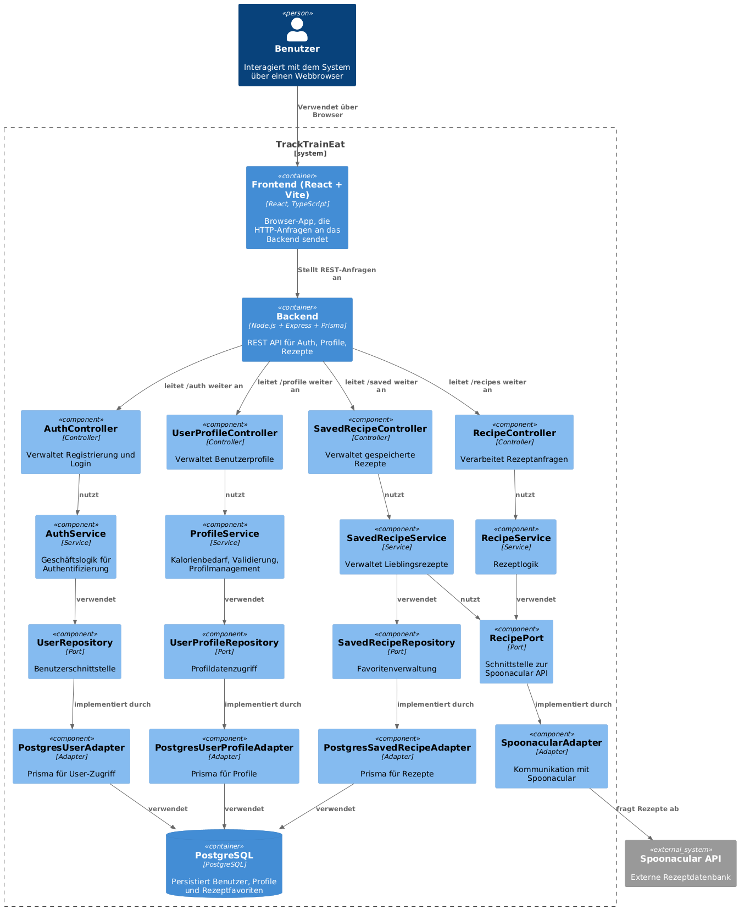
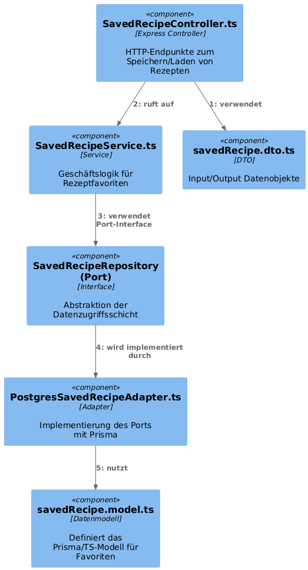

# C4-Modell – Architekturübersicht von _TrackTrainEat_

Die Softwarearchitektur von _TrackTrainEat_ wird durch vier Ebenen des C4-Modells visualisiert:

---

## Level 1 – Kontextdiagramm

Das Kontextdiagramm zeigt das System eingebettet in seine Umgebung:  
Welche externen Systeme, Nutzerrollen und Schnittstellen existieren?

### Beteiligte

- **Benutzer:in**: Interagiert mit dem System über einen Webbrowser.
- **TrackTrainEat**: Liefert personalisierte Ernährungsempfehlungen.
- **Spoonacular API**: Dient als externe Quelle für Rezept- und Nährwertdaten.

### Kommunikation

- Benutzer:innen verwenden das System über das Web.
- Das System ruft bei Bedarf die Spoonacular API über HTTP ab.



---

## Level 2 – Containerdiagramm

Das Containerdiagramm zeigt die wichtigsten technischen Teile (Container) und wie sie miteinander kommunizieren.

### Container

- **Frontend (React + Vite)**  
  → Bietet die Benutzeroberfläche im Browser, kommuniziert mit dem Backend über REST-APIs.

- **Backend (Node.js, Express, Prisma)**  
  → Kümmert sich um Authentifizierung, Profile, Rezepte und Datenlogik.

- **PostgreSQL**  
  → Persistente Speicherung aller Benutzer-, Profil- und Rezeptdaten.

- **Spoonacular API (extern)**  
  → Liefert Rezeptdaten und Nährwerte basierend auf Suchanfragen.

### Kommunikation

- Das Frontend spricht mit dem Backend via HTTP.
- Das Backend greift auf die Datenbank zu und ruft extern Daten bei Spoonacular ab.



---

## Level 3 – Komponentendiagramm

Das Komponentendiagramm zeigt die internen Strukturen des Backends, inklusive aller Hauptkomponenten.

### Schichten im Backend

- **Controller**  
  → REST-Endpunkte, die Requests entgegennehmen und validieren.

- **Services**  
  → Geschäftslogik, unabhängig von Infrastruktur.

- **Ports (Interfaces)**  
  → Definieren die Schnittstellen zu Infrastruktur (DB, APIs).

- **Adapter**  
  → Implementieren die Ports (z. B. Prisma für DB, HTTP für externe APIs).

### Beispielhafte Komponenten

- `AuthController`, `UserProfileController`, `SavedRecipeController`
- `AuthService`, `RecipeService`, `FavoriteRecipeService`
- `UserRepository`, `RecipePort`, `SavedRecipeRepository`
- `PostgresSavedRecipeAdapter`, `SpoonacularAdapter`



---

## Level 4 – Code-/Detaildiagramm (Use Case: Rezeptfavoriten)

Diese Ebene zeigt die interne Struktur und den Ablauf eines konkreten Anwendungsfalls auf Codeebene.

### Beispiel: Rezept speichern

1. `SavedRecipeController.ts` nimmt Request entgegen.
2. Ruft `SavedRecipeService.ts` auf.
3. Dieser verwendet das Interface `SavedRecipeRepository`.
4. Das Interface wird vom Adapter `PostgresSavedRecipeAdapter.ts` implementiert.
5. Der Adapter verwendet `savedRecipe.model.ts` für Datenbankzugriffe.
6. Die Datenübertragung erfolgt über `savedRecipe.dto.ts`.



```text
[Controller] → [Service] → [Port] → [Adapter] → [Modell]
```