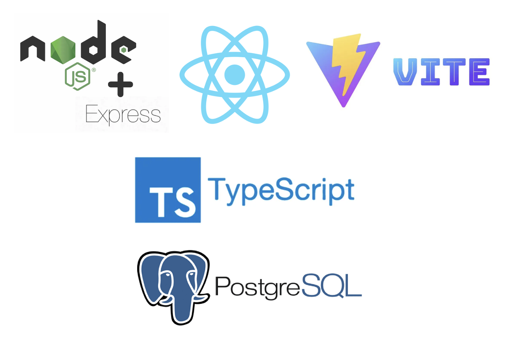

# Verwendeter Techstack

Die folgende Übersicht zeigt die eingesetzten Technologien in den verschiedenen Schichten des Projekts **TrackTrainEat**. Der Techstack wurde gezielt ausgewählt, um moderne Entwicklungsstandards, einfache Wartbarkeit, hohe Testbarkeit und Erweiterbarkeit sicherzustellen. Genauere Beschreibungen sind in der Arc42 Documentation zu finden oder in den ADR Dateien.

---

## Architekturprinzip

| Ebene | Prinzip |
|-------|---------|
| **Backend** | Hexagonale Architektur (Ports & Adapters) |
| **Frontend** | WebApp mit feature-basierter Struktur |
| **Gesamtsystem** | 3-Schichten-Architektur + externe API + Infrastruktur via Docker |

---

## Laufzeitumgebung / Infrastruktur

| Technologie | Zweck |
|-------------|-------|
| **Docker / Docker Compose** | Plattformunabhängig - Lokal aber auch nutzbar |
| **PostgreSQL (15)** | Relationale Datenbank |
| **GitHub Actions** | CI/CD-Pipeline mit Build / Tests |
| **SonarCloud** | Statische Codeanalyse, Coverage-Report |
| **dotenv (.env.docker)** | Umgebungsvariablen-Management |

---

## Frontend (React + Vite)

| Kategorie | Tools |
|----------|-------|
| Framework | `React 18` |
| Build Tool | `Vite` |
| Sprache | `TypeScript` |
| Styling | `Tailwind CSS`, `Headless UI`, `Framer Motion` |
| Routing | `React Router v7` |
| Formularvalidierung | `React Hook Form`, `Zod` |
| HTTP | `Axios` |
| UI | `Lucide React`, `React Hot Toast`, `html-react-parser` |

**Testtools Frontend**

| Typ | Tools |
|-----|-------|
| Unit/Component Tests | `Jest`, `React Testing Library (RTL)` |
| E2E Tests | `Playwright: npx playwright test --worker=1` |
| Coverage | `jest --coverage` |
| Mocking | `axios-mock-adapter`, `jest.fn()` etc. |

---

## Backend (Node.js + Express)

| Kategorie | Tools |
|----------|-------|
| Framework | `Express.js` |
| Sprache | `TypeScript` |
| Datenbankzugriff | `Prisma ORM` |
| Authentifizierung | `JWT`, `BcryptJS` |
| Validierung | `class-validator`, `Zod` |
| HTTP | `Axios`, `Axios Retry` |
| Logging / Fehler | `dotenv`, `cookie-parser`, `CORS` |

**Architekturansatz: Hexagonal**  
→ Controller ↔ Service ↔ Port ↔ Adapter ↔ Prisma ↔ PostgreSQL

**Testtools Backend**

| Typ | Tools |
|-----|-------|
| Unit Tests | `Jest`, `ts-jest` |
| Integration Tests | `Supertest`, `axios-mock-adapter`, `Nock` |
| API Tests | `Supertest` mit vollständigen Flows |
| Coverage | `npx jest --coverage` |

---

## Externe APIs

| Dienst | Nutzung |
|--------|--------|
| **Spoonacular API** | Rezeptdaten, Kalorieninformationen |
| Zugriff über Adapter | `SpoonacularAdapter.ts` via Port-Interface |

---

## Qualitätssicherung & DevOps

| Bereich | Tools & Standards |
|--------|------------------|
| Tests | Jest, Playwright, Testing Library, ts-jest, Supertest |
| Coverage | Jest + SonarCloud |
| Linting | ESLint (implizit über CI) |
| CI/CD | GitHub Actions |
| Architektur | arc42-Dokumentation, C4-Modellierung (PlantUML & Structurizr DSL) |
| ADRs | Dokumentiert unter `/docs/adr/` |

---

## Dokumentation

| Bereich | Werkzeug |
|--------|----------|
| Architektur | `arc42` (Struktur) |
| Modellierung | `PlantUML`, `C4-PlantUML`, `Structurizr DSL` |
| Präsentation | `ReadTheDocs` |

---

> **Hinweis:**  
Das Projekt nutzt ein sicheres Token-basiertes Authentifizierungssystem (JWT) und testet abgesicherte Endpunkte auch im Rahmen von Penetrationstest-ähnlichen Integrationstests.

