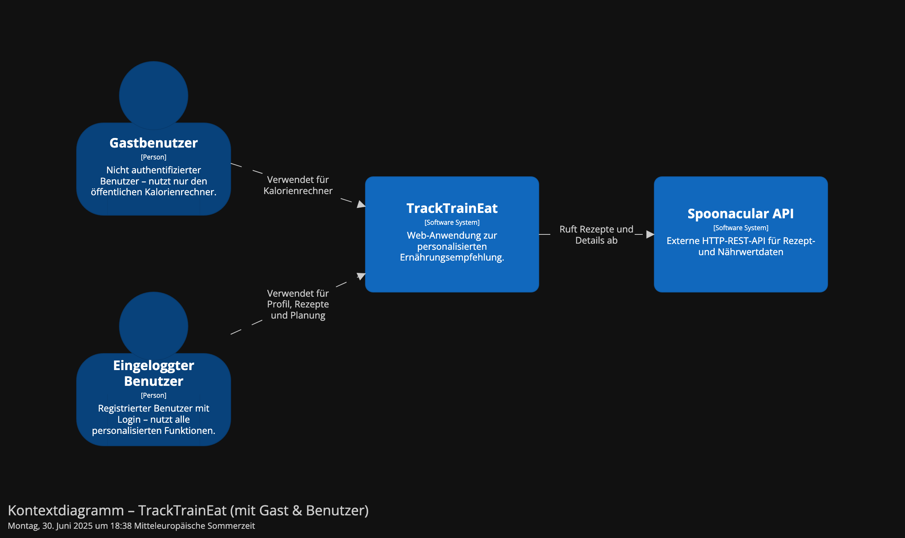

# 1. Einführung und Ziele

## 1.1 Essenzielle Funktionen der Anwendung

**TrackTrainEat** ist eine Webanwendung zur individuellen Ernährungsplanung auf Basis persönlicher Gesundheitsdaten. Sie besteht aus einem React-Frontend und einem Node.js-/Express-Backend mit PostgreSQL-Datenbank und externer Rezeptanbindung über die Spoonacular API.

Die Anwendung bietet:
- **Benutzerregistrierung, Login & Session-Handling** (JWT + Cookies)
- **Pflege eines Gesundheitsprofils**, inkl.:
  - Gewicht, Größe, Alter, Geschlecht
  - Aktivitätslevel, Zielsetzung (z. B. abnehmen, Muskeln aufbauen)
  - Ernährungsform (vegan, vegetarisch, omnivor)
- **Kalorienrechner**:
  - Öffentlich zugänglich für schnelle BMR/TDEE-Berechnung
  - Intern zur detaillierten Berechnung aus Benutzerprofil
- **Dynamische Rezeptvorschläge** via Spoonacular API
  - Basierend auf Kalorien- und Proteinbedarf des Users
  - Automatische Anpassung an Essensverteilung (Mahlzeitenplan)
- **Speicherung favorisierter Rezepte**
- **Individuelle Mahlzeitenpläne** mit Fallback-Logik bei API-Fehlern
- **Frontend mit interaktivem Dashboard**, dynamischem State und Validierung
- **Geschützte Routen** für sensitive Bereiche (z. B. Profil, gespeicherte Rezepte)

---

## 1.2 Qualitätsziele

| Ziel                  | Umsetzung                                                                 |
|------------------------|--------------------------------------------------------------------------|
| **Wartbarkeit**         | Klare Trennung in DTOs, Services, Adapter; Feature-basierte Frontendstruktur |
| **Testbarkeit**         | Unit-Tests mit Jest/Vitest; Port-Interfaces; Services isoliert testbar   |
| **Benutzerfreundlichkeit** | UX-orientiertes React-Frontend mit validierten Formularen & Kontextverwaltung |
| **Erweiterbarkeit**     | Modularer Aufbau erlaubt Austausch der Rezeptquelle oder neue Features   |
| **Sicherheit**          | Authentifizierung via JWT (httpOnly-Cookies); Zugriffsschutz via Middleware |
| **Robustheit**          | Fehlerhandling in allen Schichten; Retry-Logik bei externen API-Anfragen |
| **Portabilität**        | Komplette Dockerisierung mit `.env`-Trennung von Dev/Prod                |
| **Nachvollziehbarkeit** | Logging, konsistente Fehlercodes & Statusantworten                      |

---

## 1.3 Relevante Stakeholder und ihre Erwartungen

| Stakeholder          | Erwartungen / Anforderungen                                                      |
|----------------------|-----------------------------------------------------------------------------------|
| **Endnutzer**   | Schnelle, klare Benutzeroberfläche mit sinnvollen Rezeptvorschlägen und Aktualiseriung der Kcal und Proteine |
| **Entwickler** allgemein| Code modular und erweiterbar |
| **Frontend-Team** in Zukunft | Saubere REST-API mit vorhersehbarem Verhalten und klarer Fehlerstruktur          |
| **Backend-Team** in Zukunft | Gut strukturierter, erweiterbarer Code mit klarer Abgrenzung von Verantwortungen |

---
# 2. Randbedingungen

## 2.1 Technische Einschränkungen

| Einschränkung                  | Beschreibung                                                                 |
|--------------------------------|------------------------------------------------------------------------------|
| **Technologie-Stack festgelegt** | Das Projekt verwendet Node.js mit TypeScript im Backend und React mit TypeScript im Frontend. |
| **ORM und Datenbank**         | Prisma wird als ORM verwendet, die Datenbank ist PostgreSQL (Docker-Container basiert). |
| **Frontend**          | Das Frontend nutzt React Vite und ist zusätzlich lokal über `npm run dev` startbar. |
| **Backend**          | Das Backend nutzt Node.js und Express.js und ist zusätzlich lokal über `npm run dev` startbar. |
| **Deployment**       | Die gesamte Anwendung ist dockerisiert, einschließlich Datenbank, Backend und Frontend. |
| **Schnittstellenbindung**     | Die Anwendung ist technisch an die Spoonacular API gebunden. Ohne API-Key ist der Funktionsumfang eingeschränkt. |
| **Konfiguration über Umgebungsvariablen** | Der Betrieb erfordert `.env`-Dateien sowohl lokal als auch im Docker-Setup. |

## 2.2 Organisatorische Einschränkungen

| Einschränkung                     | Beschreibung                                                                |
|-----------------------------------|-----------------------------------------------------------------------------|
| **Alleinentwicklung**             | Das Projekt wurde vollständig eigenständig konzipiert, implementiert und dokumentiert. |
| **Feature-Struktur im Frontend** | Das Frontend ist strikt nach Features gegliedert. Diese Struktur ist technisch und organisatorisch festgelegt. |
| **API-Zugang limitiert**          | Der Zugriff auf Spoonacular ist nur mit gültigem API-Key möglich. Es gelten dort Kontingentgrenzen. |
| **Nur Online-Betrieb**            | Offline-Betrieb ist nicht vorgesehen, da essentielle Funktionen vom Online-Zugriff abhängen. |

## 2.3 Externe Abhängigkeiten

| Abhängigkeit               | Beschreibung                                                                    |
|---------------------------|----------------------------------------------------------------------------------|
| **Spoonacular API**        | Rezepte, Mealplans und Nährwertdaten werden über eine externe API bezogen. Diese kann temporär nicht erreichbar sein oder fehlschlagen. |
| **JWT + Cookie-Auth**      | Authentifizierung basiert auf Cookies und JWT – Browser-Sicherheitseinstellungen (z. B. SameSite) müssen korrekt sein. |
| **Prisma Migrations**      | Änderungen am Datenmodell erfordern korrekte Prisma-Migrationsabläufe. (ebenfalls in Install-Anleitung beschrieben) |
| **Docker + Volumes**       | Die Docker-Umgebung nutzt persistente Volumes für die PostgreSQL-Datenbank. Probleme beim lokalen Setup (z. B. Volume-Zugriff) können auftreten. |

# 3. Kontextabgrenzung

## 3.1 Systemübersicht

Das System "TrackTrainEat" ist eine browserbasierte Anwendung zur personalisierten Ernährungsplanung. Es besteht aus einem React-Frontend und einem Node.js-Backend mit PostgreSQL-Datenbank.

Das System steht im Austausch mit:

- **Benutzer eingeloggt** (über das Web-Frontend)
- **Benutzer ohne Account** (über das Web-Frontend)
- **Spoonacular API** (externe Rezepte und Nährwertdaten)
- **Browser/Client** (für Sessionhandling via Cookies)
- **Docker-Laufzeitumgebung** (für lokale Ausführung und Hosting)

## 3.2 Kommunikationspartner (extern)

| Partner             | Beschreibung |
|---------------------|--------------|
| **Benutzer**     | Nutzt die Web-App im Browser zur Profilerstellung, Kalorienberechnung, Rezeptplanung |
| **Spoonacular API** | Liefert Rezepte und Detailinformationen anhand der vom Backend gestellten Suchparameter |
| **Browser (HTTP-Client)** | Sendet Cookies für Authentifizierung automatisch mit Requests |
| **Datenbank (PostgreSQL)** | Persistenzschicht, wird über Prisma im Backend angesprochen |

## 3.3 Schnittstellenbeschreibung (fachlich)

| Schnittstelle              | Beschreibung |
|----------------------------|--------------|
| `/auth/register`, `/login` | Registrierung und Login per E-Mail + Passwort |
| `/profile` (GET/POST/PUT) | Erstellt, lädt oder aktualisiert ein Gesundheitsprofil |
| `/calculate`              | Offene Schnittstelle zur Kalorienberechnung auf Basis einfacher Nutzerdaten |
| `/calculate/from-profile` | Berechnet den Bedarf auf Basis des gespeicherten Profils |
| `/recipes`, `/mealplan`   | Liefert Rezeptvorschläge und Mahlzeitenplan |
| `/recipes/save` etc.      | Speichert und verwaltet favorisierte Rezepte |
| **Spoonacular API**        | Wird per HTTPS/REST mit API-Key und Suchparametern aufgerufen |

### Erläuterung zum Kontextdiagramm

Das Kontextdiagramm veranschaulicht die Systemumgebung von **TrackTrainEat** und zeigt, wie das System mit externen Akteuren und Nachbarsystemen interagiert.

Es gibt zwei Arten von Benutzer:innen:
- **Gastbenutzer**, die ohne Anmeldung auf öffentliche Funktionen wie den Kalorienrechner zugreifen können.
- **Eingeloggte Benutzer**, die nach Authentifizierung Zugriff auf persönliche Funktionen wie Profilverwaltung, Rezeptvorschläge und Mealplans erhalten.

Beide Rollen interagieren über ein gemeinsames **Frontend**, das als Web-Application im Browser läuft. Dieses kommuniziert mit dem **Backend**, das die Geschäftslogik kapselt und Datenzugriffe sowie API-Anfragen steuert.

Das Backend ist über eine Schnittstelle mit der **Spoonacular API** verbunden, um externe Rezeptdaten abzurufen, und verwendet eine eigene **PostgreSQL-Datenbank** zur Speicherung von Benutzer- und Profildaten.

# 4. Lösungsstrategie

Die Architektur von **TrackTrainEat** orientiert sich an pragmatischen Prinzipien einer wartbaren, testbaren und erweiterbaren Webanwendung. Dabei wurden bewusst Technologien und Strukturen gewählt, die sowohl für die initiale Umsetzung als auch für zukünftige Anpassungen skalierbar sind.

Die zentralen Architekturentscheidungen sind dokumentiert in folgenden ADRs:

- [Technologie-Stack](../docs/adr/techstack-adr.md)
- [Datenbank und ORM](../docs/adr/database-adr.md)
- [Architekturansatz (Ports & Adapters)](../docs/adr/architektur-adr.md)

---

## 4.1 Technologieentscheidungen

| Bereich      | Entscheidung                                                                 |
|--------------|------------------------------------------------------------------------------|
| **Frontend** | React (mit Vite), modular nach Feature-Foldern strukturiert (SPA)            |
| **Backend**  | Node.js + Express mit TypeScript; REST-API                                   |
| **Auth**     | JWT + Cookies (httpOnly), Middleware-geschützt                               |
| **ORM**      | Prisma (typsicher, mit Migrationssystem)                                     |
| **Datenbank**| PostgreSQL im Docker-Container                                               |
| **Integration** | REST-Anbindung an Spoonacular API für externe Rezept- und Nährwertdaten   |

---

## 4.2 Architekturentscheidungen

Im Backend kommt eine klar strukturierte, teilweise **Hexagonale Architektur (Ports & Adapters)** zum Einsatz (siehe [ADR-0003](../docs/adr/architektur.md)). Ziel war es, Geschäftslogik, Web/API-Zugriff, Datenzugriff und externe Services strikt voneinander zu trennen.

**Zentrale Strukturprinzipien:**

- **Controller**: Routing, Validierung, (HTTP Themen)
- **Services**: fachliche Logik (z.B. Kalorienberechnung, Rezeptplanung, etc)
- **Ports (Interfaces)**: abstrahierte Schnittstellen zu DB und externen APIs
- **Adapter**: konkrete Implementierungen (z. B. Spoonacular, Prisma)

Diese Architektur erleichtert:

- **Unit-Tests** ohne Infrastrukturabhängigkeit
- **Austauschbarkeit** externer Komponenten, Adapter können getauscht werden
- **Erweiterbarkeit** zB. durch alternative Datenquellen oder APIs

---

## 4.3 Einhaltung von Qualitätszielen

| Qualitätsziel           | Lösungsansatz |
|--------------------------|---------------|
| **Wartbarkeit**           | Saubere Trennung in Controllern, Services, Ports und Adaptern |
| **Testbarkeit**           | Logik testbar ohne Express/Prisma; strukturierte Services |
| **Erweiterbarkeit**       | Modulare Adapterstruktur ermöglicht neue externe Quellen oder Datenbanken |
| **Sicherheit**            | Authentifizierung mit JWT & httpOnly-Cookies; Middleware-gesteuerter Zugriff |
| **Robustheit**            | Validierung, Logging, Fehler-Handling und Retry-Mechanismen |
| **Nachvollziehbarkeit**   | Logging, standardisierte Fehlerrückgaben mit Codes und Messages |

---
## 4.4 Frontend-Architektur

Das Frontend von *TrackTrainEat* folgt einer **Feature-basierten Struktur**, bei der jedes funktionale Modul (zB. Authentifizierung, Profil, Rezepte) in einem eigenen Verzeichnis gekapselt ist. Diese Aufteilung verbessert die Wartbarkeit. 

Innerhalb eines Features finden sich in der Regel:

- **UI-Komponenten** (z. B. `components`)
- **Logik / Hooks** (z. B. `hooks`)
- **Services / API-Zugriffe**
- **Pages** 

Die App ist als **Web App** mit **React + Vite** umgesetzt, vollständig in **TypeScript** typisiert und setzt auf:

- **Formularvalidierung** (z. B. für Eingaben im Profil)
- **Zustandsmanagement** (auth Zustand etc.)
- **Axios** für API-Zugriffe, mit zentralem Error-Handling
- **Routing über React Router**

Diese Struktur ermöglicht eine klare Skalierung der Anwendung, einfache Erweiterung durch neue Features und eine robuste UI-Logiktrennung.

# 5 Baustein-Sicht

Dieses Kapitel beschreibt die wichtigsten Software-Bausteine des Systems *TrackTrainEat* und deren Zusammenhänge. Ziel ist es, die interne Struktur und die Verantwortlichkeiten der einzelnen Komponenten nachvollziehbar darzustellen.

## 5.1 Überblick

Die Anwendung besteht aus mehreren klar getrennten Schichten und Modulen, die teilweise der hexagonalen Architektur folgen. Dies ermöglicht eine hohe Modularität, gute Testbarkeit und Austauschbarkeit von Komponenten.

Das System gliedert sich grob in:
---

## 5.2 Backend Whitebox

Das Backend ist modular aufgebaut und gliedert sich in folgende Bausteine:

### Controller  
Verantwortlich für die Entgegennahme und Validierung von HTTP-Anfragen sowie die Koordination der Geschäftslogik.

- **AuthController**: Registrierung und Login der Nutzer.  
- **UserProfileController**: Verwaltung und Aktualisierung von Benutzerprofilen.  
- **RecipeController**: Rezeptsuche, Rezeptdetails und Mahlzeitenplanung.  
- **SavedRecipeController**: Verwaltung von gespeicherten Lieblingsrezepten.

### Services  
Implementieren die Geschäftslogik und arbeiten über Schnittstellen (Ports) mit Datenquellen.

- **AuthService**: Geschäftslogik für Authentifizierung.  
- **ProfileService**: Berechnung von Kalorienbedarf und Profildatenmanagement.  
- **RecipeService**: Rezeptlogik, Anbindung an externe Rezept-API.  
- **SavedRecipeService**: Verwaltung und Abruf gespeicherter Rezepte.

### Ports (Interfaces)  
Definieren Schnittstellen zur Anbindung von Adaptern, um Implementierungsdetails zu kapseln.

- **UserRepository**: Schnittstelle zur Benutzerverwaltung.  
- **UserProfileRepository**: Schnittstelle für Gesundheitsprofile.  
- **SavedRecipeRepository**: Schnittstelle für Favoritenverwaltung.  
- **RecipePort**: Schnittstelle zur Rezeptdatenbeschaffung (externe API).

### Adapter  
Konkrete Implementierungen der Ports, die mit der Datenbank oder externen APIs kommunizieren.

- **PostgresUserAdapter**: Zugriff auf Benutzer-Datenbanktabellen via Prisma.  
- **PostgresUserProfileAdapter**: Zugriff auf Profil-Datenbanktabellen.  
- **PostgresSavedRecipeAdapter**: Zugriff auf Rezeptfavoriten-Datenbanktabellen.  
- **SpoonacularAdapter**: Kommunikation mit der externen Rezept-API.

### Datenbank & Externe API  
- **PostgreSQL**: Persistente Speicherung.  
- **Spoonacular API**: Externe Rezept- und Nährwertdatenquelle.

### Kommunikationsfluss

Die Pfeile im Diagramm zeigen den Aufruffluss:

- **Frontend → Controller → Service → Port → Adapter → Datenbank/Externe API**

Dies entspricht dem Prinzip der Hexagonalen Architektur (Ports & Adapters), wobei der Service die Geschäftslogik kapselt und die Adapter die konkrete technische Umsetzung übernehmen.

---

## 5.3 Frontend Whitebox

Das Frontend besteht aus folgenden Komponenten, die den Nutzerfluss und UI-Funktionalitäten abbilden:

- **Landing**: Öffentliche Startseite mit Kalorienrechner (für Gäste).  
- **Auth**: Login und Registrierung, Session-Verwaltung für Benutzer:innen.  
- **Dashboard**: Tagesübersicht mit personalisierten Ernährungsempfehlungen.  
- **MyRecipes**: Anzeige und Verwaltung von gespeicherten Rezepten.  
- **Profile**: Pflege und Anzeige von Benutzerprofilen.

### Kommunikation

Das Frontend kommuniziert mit dem Backend über definierte REST-Endpunkte für Authentifizierung, Profilmanagement, Rezeptsuche und Speicherung.

---

## 5.4 Zusammenfassung

Die Baustein-Sicht zeigt eine klare Trennung zwischen den verschiedenen Verantwortlichkeiten der Komponenten und die saubere Anbindung von Datenquellen durch Ports und Adapter.  

Das Design unterstützt Modularität, Testbarkeit und einfache Erweiterbarkeit des Systems.

# Kapitel 6: Laufzeitsicht

In diesem Kapitel wird das dynamische Verhalten des Systems anhand von Sequenzdiagrammen dargestellt. Die Diagramme zeigen die Abläufe und Interaktionen zwischen Benutzer, Frontend, Backend-Komponenten, Datenbanken und externen Systemen. Dabei wird der Fokus auf die wichtigsten Anwendungsfälle gelegt, um die Architektur und die Ablauflogik transparent und nachvollziehbar zu machen. Es handelt sich um viel Logik wodurch die Diagramme der Übersichthalber aufgeteilt wurden statt alles in einem. Das Error-handling wird hier ebenfalls nicht zu 100% betrachtet - da es mehr darum geht zu verstehen wie der Ablauf in Sequenzen ist!

---

## Registrierung

Der Registrierungs-Flow beschreibt, wie ein neuer Benutzer seine Daten (E-Mail und Passwort) an das Frontend sendet, welche diese an den AuthController weiterleitet. Der AuthService überprüft über das UserRepository, ob die E-Mail bereits existiert. Falls ja, wird ein Fehler zurückgegeben, andernfalls wird der Benutzer in der Datenbank gespeichert. Eine erfolgreiche Registrierung wird anschließend bestätigt.

---

## Login

Beim Login sendet der Benutzer seine Zugangsdaten an das Frontend, das sie an den AuthController weitergibt. Der AuthService prüft die Existenz des Benutzers und die Passwortgültigkeit via UserRepository. Bei falschen Zugangsdaten wird ein Fehler zurückgegeben, bei Erfolg wird ein JWT-Token erstellt und an das Frontend übermittelt.

---

## Rezept speichern

Der Benutzer fordert das Speichern eines Rezepts an. Das Frontend leitet diese Anfrage an den SavedRecipeController weiter, welcher den SavedRecipeService aufruft. Der Service fragt über den RecipePort (SpoonacularAdapter) die Rezeptdetails von der externen API ab. Nach erfolgreichem Abruf wird das Rezept im SavedRecipeRepository gespeichert. Fehler während der API-Abfrage oder beim Speichern werden an das Frontend kommuniziert und entsprechend behandelt.

---

## Profil erstellen/ändern

Der Nutzer gibt Profildaten ein oder ändert diese. Diese werden vom Frontend an den UserProfileController gesendet, der den ProfileService aufruft. Der Service validiert die Daten und speichert oder aktualisiert das Profil über den PostgresUserProfileAdapter in der Datenbank. Datenbankfehler, wie z.B. Unique-Constraint-Verstöße, werden als Fehler an den Nutzer zurückgegeben und entsprechend kommuniziert.

---

## Rezeptabruf und Mealplan-Generierung

Das Frontend fordert einen Mealplan an, der Benutzerpräferenzen und UserId enthält. Der RecipeController ruft im RecipeService die Profilinformationen ab, berechnet Kalorien- und Proteinbedarf und fragt über den RecipePort (SpoonacularAdapter) passende Rezepte bei der externen API ab. Der Service erstellt den Mealplan, welcher an das Frontend zurückgegeben wird. Fehler beim API-Zugriff oder fehlende Profile werden erkannt und an den Nutzer weitergegeben.

---

Diese Sequenzdiagramme bieten einen umfassenden Einblick in die Abläufe innerhalb des Backends, die Interaktion mit externen Diensten und der Datenbank sowie die Einbindung des Frontends. Somit ist das Kapitel 6 - Laufzeitsicht vollständig abgedeckt.

# Kapitel 7 – Verteilungssicht

Dieses Kapitel beschreibt die Verteilung der Softwarekomponenten und Infrastruktur innerhalb der Entwicklungsumgebung von TrackTrainEat.

## Systemübersicht

Die Anwendung besteht aus mehreren Docker-Containern, die auf dem lokalen Entwicklungsrechner (Dev-Host) laufen und über ein Docker-Netzwerk verbunden sind:

- **PostgreSQL Container**  
  Verantwortlich für die persistente Speicherung von Benutzerdaten, Benutzerprofilen und Rezept-Favoriten. Die Daten werden in einem persistenten Docker-Volume (`pgdata`) gespeichert und der Container ist über den Port 5432 erreichbar.

- **Backend Container**  
  Implementiert die REST-API mit Node.js, Express und Prisma. Er stellt Endpunkte für Authentifizierung, Benutzerprofile, Rezeptmanagement und Analysen bereit. Zudem führt der Container bei Start die Datenbankmigrationen mit Prisma durch. Der Container ist über Port 8000 verfügbar und mountet den lokalen Backend-Code für Live-Entwicklung.

- **Frontend Container**  
  Läuft der React-basierte Vite-Dev-Server, der die Single Page Application bereitstellt. Er ist über Port 5173 erreichbar und mountet das Frontend-Quellverzeichnis für Hot-Reloading. Nutzer:innen greifen im Browser auf diesen Container zu.

- **Externe Spoonacular API (Cloud)**  
  Die Backend-Komponente greift auf diese externe Cloud-API zu, um Rezept- und Nährwertdaten abzufragen.

## Kommunikationsflüsse

- Der **User** nutzt den Webbrowser und ruft die Frontend-Webanwendung auf, die im Frontend-Container läuft.
- Das **Frontend** kommuniziert mit dem **Backend** via HTTP REST API, um Daten wie Authentifizierung, Benutzerprofile, Rezeptinformationen und Analysen zu laden oder zu speichern.
- Das **Backend** nutzt den Prisma Client zur Kommunikation mit der **PostgreSQL-Datenbank**, um Daten persistent zu speichern und abzufragen.
- Für Rezeptdaten ruft das Backend die externe **Spoonacular API** an, um aktuelle Rezept- und Nährwertinformationen zu erhalten.
- Beim Start führt das Backend Migrationen auf der Datenbank durch, um das Schema aktuell zu halten.

## Infrastruktur

Diese Verteilung unterstützt eine modulare und isolierte Entwicklungsumgebung, die über Docker Compose orchestriert wird. Jeder Dienst läuft in einem eigenen Container, was einfache Wartung, Skalierung und Unabhängigkeit gewährleistet.

---

Dieses Deployment-Diagramm und die Beschreibung erfüllen die Anforderungen der Verteilungssicht nach arc42, indem sie klar darstellen, wie die Softwarekomponenten verteilt und miteinander verbunden sind.

# Kapitel 8 – Querschnittliche Konzepte

Dieses Kapitel beschreibt allgemeine Konzepte und übergreifende technische Entscheidungen, die im gesamten System *TrackTrainEat* angewendet werden. Diese Konzepte gelten systemweit und erleichtern sowohl die Wartbarkeit als auch die Verständlichkeit des Systems.

## 1. Architekturmuster

Das System folgt dem Prinzip der **Hexagonalen Architektur (Ports & Adapters)**:

- Die Geschäftslogik ist unabhängig von der technischen Infrastruktur.
- Kommunikation erfolgt über klar definierte **Ports** (Interfaces).
- Konkrete Implementierungen wie z. B. Datenbankzugriffe oder externe APIs erfolgen über **Adapter**.

**Beispiel**:
- Der `RecipePort` definiert, wie Rezepte abgefragt werden – unabhängig davon, ob die Quelle lokal oder extern (z. B. Spoonacular) ist.
- Der `SpoonacularAdapter` implementiert diesen Port und übernimmt die HTTP-Kommunikation mit der externen API.

Das folgende UML-Komponentendiagramm veranschaulicht die Grundstruktur der Backend-Architektur nach dem Prinzip der Hexagonalen Architektur:

- Die **Geschäftslogik** befindet sich zentral in den Service-Komponenten (`AuthService`, `ProfileService`, `RecipeService`, `FavoriteRecipeService`).
- **Ports** wie `UserRepository`, `RecipePort` oder `SavedRecipeRepository` stellen abstrakte Schnittstellen für externe Zugriffe dar.
- Die konkrete Kommunikation mit Datenbank oder externer API erfolgt über **Adapter**, z. B. `PostgresUserAdapter` oder `SpoonacularAdapter`.
- **Controller-Komponenten** wie `AuthController` oder `RecipeController` übernehmen die Übersetzung von HTTP-Anfragen in Service-Aufrufe.

Das Diagramm zeigt außerdem die klare Trennung der Schichten und Datenflüsse:

- **Frontend** kommuniziert ausschließlich mit den Controllern.
- Die Geschäftslogik ist **entkoppelt** von Implementierungsdetails wie Datenbank oder HTTP-Clients.
- Die Adapterschicht kapselt konkrete Technologieentscheidungen und kommuniziert mit der Datenbank bzw. der externen Spoonacular-API.

Diese Struktur macht die Anwendung modular, testbar und erweiterbar und ist zentraler Bestandteil des Architekturkonzepts.

## 2. Code- und Strukturkonventionen

- **Technologiestack Backend**: Node.js + Express + Prisma
- **Technologiestack Frontend**: React + Vite + TypeScript
- **Code-Stil**:
  - TypeScript mit striktem Linting (z. B. ESLint, Prettier)
  - Feature-basierte Struktur (z. B. `auth`, `profile`, `recipes`, ...)
- **Datei-/Ordnerstruktur**:
  - Trennung in Controller, Services, Ports, Adapter
  - Klare Separation von Verantwortlichkeiten pro Layer

## 3. Validierung & Fehlerbehandlung

- Eingaben (z. B. bei Registrierung, Profilen) werden validiert via DTO-Logik und zentralen Klassen (z. B. `ProfileAdapter`).
- Fehler werden domain-spezifisch behandelt, z. B.:
  - `email_taken`
  - `profile_already_existing`
  - `spoonacular_auth_error`
- Fehler werden in konsistenter Weise mit HTTP-Codes und JSON-Antworten an das Frontend gegeben.

## 4. Datenzugriff & Persistenz

- **Prisma ORM** wird verwendet für den Zugriff auf eine **PostgreSQL-Datenbank**.
- Migrationen und Schema-Generierung erfolgen automatisiert beim Starten des Containers.
- Datenmodelle sind strikt typisiert und werden versioniert gepflegt.

## 5. Sicherheit & Authentifizierung

- Authentifizierung basiert auf **JWT (JSON Web Tokens)**.
- Tokens werden beim Login generiert und in HTTP-Headern vom Frontend übermittelt.
- Endpunkte im Backend prüfen die Gültigkeit des Tokens via Middleware.
- Passwort-Hashing mit `bcrypt`.

## 6. Kommunikation & externe Dienste

- Das System ruft die **Spoonacular API** zur Generierung von Rezepten und Nährwertdaten auf.
- Externe Kommunikation ist gekapselt im `SpoonacularAdapter`.
- Die API-Nutzung ist fehleranfällig – daher gibt es robustes Error-Handling mit semantischen Fehlercodes.

## 7. Entwicklung & Deployment

- Lokale Entwicklung mit **Docker Compose**:
  - Container für Datenbank, Backend, Frontend
- Hot-Reload für Frontend über Vite Dev Server
- Datenbankdaten persistent über Volume `pgdata`
- Entwicklungsumgebung spiegelt möglichst realistische Struktur wider

## 8. Logging & Debugging

- Konsolen-Logging im Backend zur Laufzeit - Fehler Codes werden erstellt und mitgeliefert
- Im Frontend intepretiert dann eine handleApiError die codes und gibt Fehlermeldungen aus
- Loggingpunkte an strategischen Stellen (Start, Fehler, externe Anfragen)

---

Diese Konzepte sichern eine einheitliche und wartbare Systemarchitektur und sind durchgängig in Frontend, Backend und Infrastruktur umgesetzt.

---

## 9. Architekturentscheidungen

In diesem Kapitel werden zentrale Architekturentscheidungen für das System *TrackTrainEat* dokumentiert, die weitreichende Auswirkungen auf Struktur, Technologie und Wartbarkeit haben. Details zu diesen Entscheidungen sind in Form einzelner ADRs im Projekt unter `docs/adr/` versioniert abgelegt.

### 9.1 Überblick über die getroffenen Entscheidungen

| ADR-Datei           | Titel                                                        | Status     | Datum         |
|---------------------|--------------------------------------------------------------|------------|---------------|
| `architektur`    | Anwendung einer hexagonalen Architektur (Ports & Adapters)   | accepted   | 2025-06-30     |
| `database`       | Entscheidung für PostgreSQL mit Prisma als ORM               | accepted   | 2025-04-30     |
| `techstack`      | Auswahl und Zusammensetzung des Technologie-Stacks           | accepted   | 2025-04-30     |

### 9.2 Inhalte der Entscheidungen (Kurzfassung)

#### Hexagonale Architektur (ADR: `architektur.md`)

Das Backend folgt einem hexagonalen Architekturansatz, um die Geschäftslogik von Frameworks (z. B. Express, Prisma) zu entkoppeln. Kernprinzipien sind:

- Trennung von Controller, Service, Port und Adapter
- Erhöhte Testbarkeit durch Interface-Abstraktion
- Adapter kapseln technische Abhängigkeiten (z. B. Datenbankzugriff, externe APIs)

#### PostgreSQL + Prisma (ADR: `database.md`)

Zur Verwaltung relationaler Datenstrukturen wird PostgreSQL in Verbindung mit dem ORM Prisma eingesetzt. Die Gründe:

- Typensichere Datenzugriffe und einfache Migrationssteuerung
- Leistungsfähige, stabile Open-Source-Datenbank
- Gute Integration in den TypeScript-Stack

#### Technologie-Stack (ADR: `techstack.md`)

Das Projekt setzt bewusst auf folgende Technologien:

- **Frontend**: React, Vite, TypeScript
- **Backend**: Node.js, Express, Prisma
- **Datenbank**: PostgreSQL
- **API-Integration**: Spoonacular
- **Entwicklungsumgebung**: Docker Compose

Diese Kombination wurde aufgrund ihrer modernen Tooling-Unterstützung, Entwicklerfreundlichkeit und klaren Dokumentation ausgewählt.

---

## 10. Qualitätsanforderungen

Die Anwendung **TrackTrainEat** zielt darauf ab, Benutzer:innen bei einer personalisierten Ernährungsauswahl zu unterstützen. Dabei ergeben sich verschiedene nicht-funktionale Anforderungen, die über die reine Feature-Implementierung hinausgehen.

### Wichtigste Qualitätsziele

| Qualität | Beschreibung |
|----------|--------------|
| **Performance** | Schnelle Antwortzeiten, insbesondere beim Abrufen von Rezeptdaten über die Spoonacular API oder bei der Generierung von Mealplans.|
| **Testbarkeit** | Durch die hexagonale Architektur sind Services und Ports isoliert testbar. Unit-Tests auf Service-Ebene und Integrationstests mit Prisma sind implementiert. Zudem gibt es End To End tests mit PlayWright |
| **Wartbarkeit** | Der modulare Aufbau mit klaren Schichten (Controller, Service, Port, Adapter) erlaubt eine einfache Erweiterung oder Anpassung ohne Eingriff in bestehende Logik. |
| **Fehlerbehandlung** | Fehlercodes aus externen APIs (z. B. Spoonacular-Auth-Fehler) werden erfasst und in verständliche, benutzerfreundliche Fehlermeldungen umgewandelt. |
| **Portabilität** | Lokales Setup basiert vollständig auf Docker Compose. Damit ist die gesamte Anwendung (Datenbank, Backend, Frontend) leicht auf anderen Rechnern ausführbar. |

### Weitere Qualitätsaspekte

| Qualität | Umsetzung im Projekt |
|----------|-----------------------|
| **Responsiveness** | Die React-Frontend-Anwendung ist als Web App umgesetzt und läuft performant auf modernen Geräten. |
| **First Contentful Paint** | Durch Vite und modernes JavaScript-Bundling werden Ressourcen effizient geladen, um initiale Ladezeit gering zu halten. |
| **Security** | Passwörter werden gehashed gespeichert, Authentifizierung erfolgt über JWT-Tokens. Zugriffskontrollen sind per Middleware implementiert. |
| **Technologische Konsistenz** | Der Code folgt einem durchgängigen TypeScript-Stil. Backend und Frontend verwenden dieselbe Sprache und einheitliche Typdefinitionen (z. B. für DTOs). |
| **Dokumentation** | ADRs dokumentieren wichtige Entscheidungen. Strukturdiagramme (Kapitel 5–7) und Laufzeitsichten (Kapitel 6) erklären die Architektur nachvollziehbar. |

## 11. Risiken und technische Schulden

In diesem Kapitel werden potenzielle Risiken sowie bereits bekannte technische Schulden des Systems **TrackTrainEat** dokumentiert. Diese Liste ist nach **Priorität** sortiert, um bei Weiterentwicklung oder Wartung gezielt adressiert zu werden.

---

### 🟥 Hochpriorisierte Risiken

| Kategorie | Risiko | Beschreibung | Mögliche Maßnahme |
|----------|--------|--------------|--------------------|
| **Technisch** | Spoonacular API-Ausfall oder -Limitierung | Die Rezeptdaten stammen von einer externen API. Bei Ausfällen oder Erreichen von Rate Limits ist keine Funktionalität zur Rezeptgenerierung mehr verfügbar. | Einführung eines API-Caching-Mechanismus oder alternativer Datenquellen |
| **Technisch** | Prisma-Migrationsprobleme im Deployment | Der `prisma migrate deploy`-Prozess muss manuell korrekt ausgelöst werden. In Docker-Umgebungen ist das fehleranfällig. | Langfristig CI/CD mit Migrationsüberwachung integrieren |
| **Fachlich** | Unflexible Nährwert-Logik | Die Berechnungen basieren derzeit auf einem statischen Algorithmus. Personalisierbare Ernährungsziele sind schwer skalierbar. | Refaktorierung mit flexiblen Regeldefinitionen für Profile & Ziele |
| **Technisch** | Kein zentrales Error-Monitoring | Fehler werden lokal geloggt, aber nicht aggregiert oder überwacht. | Einführung von Logging- & Monitoring-Tools wie Sentry oder Logtail |

---

### Mittlere Priorität

| Kategorie       | Risiko                             | Beschreibung                                                                 | Mögliche Maßnahme |
|----------------|------------------------------------|------------------------------------------------------------------------------|--------------------|
| **Technisch**   | Keine Offline-Unterstützung        | Die Webanwendung benötigt eine aktive Verbindung – keine Caching/Fallbacks. | (Optional) Einsatz von ServiceWorker für Offline-Zugriff oder LocalStorage |
| **Architektur** | Enge Kopplung an Framework-DTOs    | In einzelnen Fällen sind Services noch eng an Framework-nahe Datenstrukturen gebunden. | Weiterer Einsatz von Mappingschichten oder reinen Domänenobjekten |
| **Deployment**  | Keine produktionsnahe Stage        | Es existieren zwar CI/CD-Prozesse, aber kein vollwertiger Staging-Clone der Produktivumgebung. | Optionaler Aufbau einer dedizierten Staging-Umgebung zur Vorabvalidierung |

---

### Geringe Priorität / Technische Schulden

| Kategorie         | Risiko                            | Beschreibung                                                                 | Mögliche Maßnahme |
|------------------|-----------------------------------|------------------------------------------------------------------------------|--------------------|
| **Technisch**     | Monolithisches Backend            | Alle Features sind in einem Node.js-Projekt vereint. Der Umfang ist aktuell aber noch beherrschbar. | Bei späterem Wachstum: Modularisierung oder Aufteilung in Services prüfen |
| **Dokumentation** | ADRs nicht zentral eingebunden    | Die Architekturentscheidungen liegen lokal in Markdown-Dateien (`docs/adr`). | Integration über ReadTheDocs, Docusaurus oder ADR-Viewer-Tool planen |
| **Testing**       | – *(kein Risiko)*                 |  Alle kritischen Komponenten sind durch Unit-, Integration- und E2E-Tests abgedeckt. | – |

---
## 12. Glossar

| Begriff                 | Bedeutung                                                                 |
|------------------------|---------------------------------------------------------------------------|
| **Benutzerprofil**      | Strukturierte Daten eines Nutzers zu Gewicht, Größe, Aktivität etc., die zur Berechnung des Kalorienbedarfs verwendet werden. |
| **Kalorienbedarf**      | Empfohlene tägliche Kalorienmenge auf Basis des Benutzerprofils.         |
| **Proteinbedarf**       | Empfohlene tägliche Eiweißzufuhr je nach Ziel (z. B. Muskelaufbau, Diät).|
| **Spoonacular API**     | Externer Dienst zur Abfrage von Rezepten, Nährwerten und Rezeptdetails.   |
| **Favorisiertes Rezept**| Ein Rezept, das von einem Benutzer gespeichert wurde, um es später wieder aufzurufen. |
| **Mealplan**            | Automatisch generierter Essensplan für einen Tag basierend auf Kalorien- und Proteinbedarf. |
| **Frontend**            | Web-Oberfläche (SPA mit React), über die Benutzer:innen mit dem System interagieren. |
| **Backend**             | Serveranwendung (Node.js), die Authentifizierung, Businesslogik und Datenzugriff bereitstellt. |
| **Port**                | Interface zur Entkopplung von Domänenlogik und Infrastruktur (z. B. `RecipePort`). |
| **Adapter**             | Implementierung eines Ports, um externe Systeme wie Datenbank oder Spoonacular API anzubinden. |
| **DTO** (Data Transfer Object) | Objekt, das zwischen Client und Server übertragen wird, z. B. bei Registrierung oder Profilerstellung. |
| **CI/CD**               | Automatisierter Prozess zum Testen und Deployen der Anwendung via GitHub Actions. |
| **Prisma**              | Typsicheres ORM (Object-Relational Mapping) zur Interaktion mit PostgreSQL. |
| **Hexagonale Architektur** | Architekturstil mit klarer Trennung zwischen Domäne, Ports, Adaptern und Infrastruktur. |

